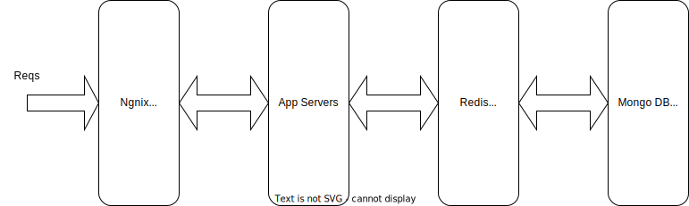

# Urlinfo Project
Url lookup service

Urlinfo is used provide a Url lookup Api service for validating a malware url and it also provide methods to update its malware url database. 


## Architecture



- Ngnix 
  
    The ngnix server is used as a load balancer for the application servers. Besides that, I also use it to do the rate limiting for controlling the traffic. 

- Application Servers
    
    The Url lookup service instances, created by using Go and Go-zero framework. We could deploy several instances to handle a large number of requests. Inside the application, the rate limiting logic is also added to control the requests. 

    Two kinds of apis provided in this service:
       
        1.  Url lookup 
        2.  Update or Batch update the Urls 

    Swagger API Doc [file](docs/urlinfo.md)


- Redis

    The redis instance or cluster is used to do the DB cache. Two configurations are added to redis to maintain the Key eviction.
    ```
        maxmemory-policy allkeys-lru
        maxmemory 300mb
    ```

- Mongo DB Shard Cluster

    In order to store data and make the queries efficiently, I create a Mongo DB Shard Cluster as the storage part. The Shard Cluster can handle large number of Url Data. Each Shard in the cluster is a replica set and I use the read preference to split the Read and Write requests. This mechanism can ensure the performance of data reading and writing. 

## How it works

The application is written by Go and based on the [go-zero](https://github.com/zeromicro/go-zero) project (MIT License). It handle the requests from client side and also use tokenlimit to control the number of requests in order to reduce the server load.

To reduce the memory usage in the app server and ensure the performance, we maintain all the url data in a Mongo DB Shard Cluster and the **secondaryPreferred** read preference is applied to split the reading and writing requests. 

The new data can be populated by using update/batch update api and we could have another process to automatically update the data by invoking those apis. 

The application can be run individually by using the bellow command after setting up the db and redis.

    go run urlinfo/urlinfo.go -f urlinfo/etc/urlinfo-api.yaml

One config yaml sample is as follows

```
Name: urlinfo-api
Host: 0.0.0.0
Port: 8888
DataSource: mongodb://localhost:27017/demo?readPreference=secondaryPreferred
Collection: urls
Cache:
  - Host: localhost:6379
```

Besides that, we could also use make file to build the binary and the docker image of this application easily. 

Build Binary file:
```
    make build
```

Build Docker image:
```
    make build_image
```

## Setting up a complete demo with containers

To demonstrate how this solution works, one [docker compose file](compose-solution/docker-compose.yml) has been created to create this solution by using several containers. 

1. Go to the folder [compose-solution](compose-solution/)

2. Before doing the creation, the docker image of this application should be created first. It can be easily created with ```make build_image```. 

   The configuraion of application container can be modified in [urlinfo-api.yaml](compose-solution/app/urlinfo-api.yaml).

3. Creation:

```
    docker-compose up --build -d
```

4. Deletion:
```
    docker-compose down
```

Several sample requests can be found [here](compose-solution/sample_reqs.md).
 
## Future work

- Perform Loadtest with a large mount of data to know the limit

- Adding monitoring system to this api service by using prometheus

- If the workload for this api service is really high, we could migrate this service from Monolithic Service to Micro service and this will improve the capacity to do horizontal scaling.  

- One cronjob can be created to automatically update the Url Data

